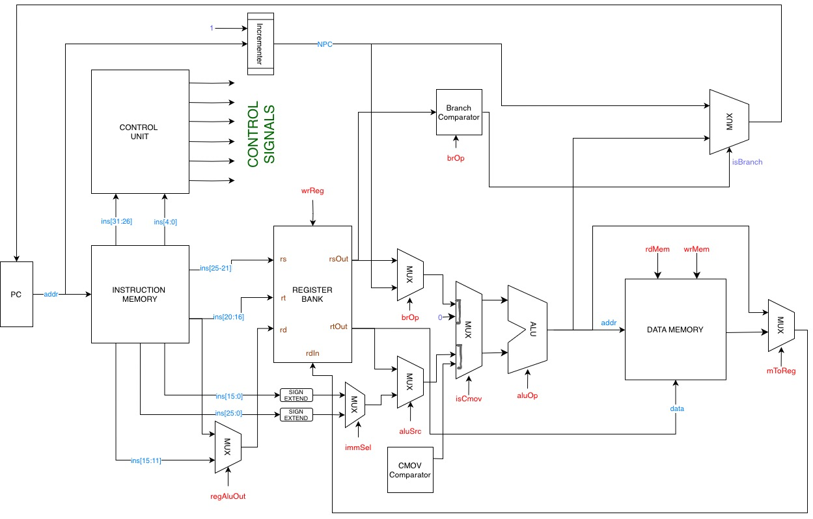

# Design and Synthesis of a 32-bit RISC Processor

**CS39001 — Computer Organization and Architecture Laboratory**
Department of Computer Science and Engineering, IIT Kharagpur

A complete 32-bit RISC processor designed in Verilog, simulated, synthesized, and
implemented on a **Digilent Nexys 4 DDR (AMD Artix-7)** FPGA using **AMD Vivado**. The processor
implements a custom load–store Instruction Set Architecture (ISA) with a hardwired
control unit and a multi-cycle, FSM-controlled datapath. Two demonstration programs —
**Booth's multiplication** and **Hamming-weight (population count)** — run on real
hardware with results displayed on the board LEDs.

> The complete, final deliverable lives in [Final_submission/](Final_submission/).
> The full ISA specification (instruction encodings, control-signal tables, datapath
> schematic) is documented in [ISA REPORT FILE.pdf](ISA%20REPORT%20FILE.pdf).

---

## Objective

- Design a custom **fixed-length 32-bit RISC ISA** (R-, I-, J-type and program-control formats).
- Implement the corresponding **datapath** and a **hardwired (combinational) control unit** in Verilog.
- Build the ALU and supporting logic from **structural gate-level building blocks** (adders, subtractors, logic gates, shifters).
- Drive the design with a **multi-cycle FSM** (Fetch → Decode → Execute → Memory → Write-back).
- **Synthesize and implement** the design in AMD Vivado, mapping I/O to a real FPGA board.
- **Verify** functionality through simulation testbenches and on-board demonstration programs.

---

## Team Members — Group 2

| Name | Roll Number |
|------|-------------|
| Parag Mahadeo Chimankar | 23CS10049 |
| Harshit Singhal | 23CS10025 |

---

## Architecture

### Datapath



The single-bus datapath is fully structural and connects the Program Counter,
Instruction Memory, Register Bank, ALU, Branch/CMOV comparators, and Data Memory
through a set of multiplexers steered by the control unit.

**Instruction flow through the datapath:**

1. **Instruction Fetch** — The **Program Counter (PC)** holds the current address and presents it to **Instruction Memory**. An incrementer computes `PC + 4` for the next instruction.
2. **Decode & Register Read** — `rs` and `rt` fields index the **Register Bank**, producing `rsOut` and `rtOut`. The control unit decodes the `opcode`/`funct` into control signals.
3. **Execute** — The ALU takes `rsOut` as operand A. The `aluSrc` MUX selects operand B (`rtOut` for R-type, the sign-extended immediate for I-type). `aluOp` chooses the operation.
4. **Memory Access** — For `LD`/`ST`, the ALU result is used as the data-memory address; `rdMem`/`wrMem` drive the read/write.
5. **Write Back** — The `mToReg` MUX selects the write-back source (ALU result or loaded memory data) and `wrReg` commits it to the destination register.
6. **PC Update** — PC advances to `PC + 4`, or to a branch/jump target when the branch comparator asserts `isBranch`.

### Instruction Set Architecture (ISA)

Fixed **32-bit** instruction length. The top 6 bits (`instr[31:26]`) are always the
opcode. The register file holds **16 general-purpose 32-bit registers**.

**R-Type** `| opcode[31:26] | rs[25:21] | rt[20:16] | rd[15:11] | -- [10:6] | funct[4:0] |`

| Instr | Usage | Opcode | Funct | | Instr | Usage | Opcode | Funct |
|-------|-------|--------|-------|---|-------|-------|--------|-------|
| ADD | `ADD rd,rs,rt` | 000000 | 00001 | | SRA | `SRA rd,rs,rt` | 000000 | 01001 |
| SUB | `SUB rd,rs,rt` | 000000 | 00010 | | SLT | `SLT rd,rs,rt` | 000000 | 01010 |
| AND | `AND rd,rs,rt` | 000000 | 00011 | | SGT | `SGT rd,rs,rt` | 000000 | 01011 |
| OR  | `OR rd,rs,rt`  | 000000 | 00100 | | NOT | `NOT rd,rt`    | 000000 | 01100 |
| XOR | `XOR rd,rs,rt` | 000000 | 00101 | | INC | `INC rd,rt`    | 000000 | 01101 |
| NOR | `NOR rd,rs,rt` | 000000 | 00110 | | DEC | `DEC rd,rt`    | 000000 | 01110 |
| SL  | `SL rd,rs,rt`  | 000000 | 00111 | | HAM | `HAM rd,rt`    | 000000 | 01111 |
| SRL | `SRL rd,rs,rt` | 000000 | 01000 | | | | | |

**I-Type** `| opcode[31:26] | rs[25:21] | rt[20:16] | immediate[15:0] |`

| Instr | Usage | Opcode | | Instr | Usage | Opcode |
|-------|-------|--------|---|-------|-------|--------|
| ADDI | `ADDI rt,rs,imm` | 000001 | | SGTI | `SGTI rt,rs,imm` | 001011 |
| SUBI | `SUBI rt,rs,imm` | 000010 | | NOTI | `NOTI rt,imm`    | 001100 |
| ANDI | `ANDI rt,rs,imm` | 000011 | | INCI | `INCI rt,imm`    | 001101 |
| ORI  | `ORI rt,rs,imm`  | 000100 | | DECI | `DECI rt,imm`    | 001110 |
| XORI | `XORI rt,rs,imm` | 000101 | | HAMI | `HAMI rt,imm`    | 001111 |
| NORI | `NORI rt,rs,imm` | 000110 | | LUI  | `LUI rt,imm`     | 010000 |
| SLI  | `SLI rt,rs,imm`  | 000111 | | LD   | `LD rt,imm(rs)`  | 010001 |
| SRLI | `SRLI rt,rs,imm` | 001000 | | ST   | `ST rt,imm(rs)`  | 010010 |
| SRAI | `SRAI rt,rs,imm` | 001001 | | BMI  | `BMI rs,imm`     | 100001 |
| SLTI | `SLTI rt,rs,imm` | 001010 | | BPL  | `BPL rs,imm`     | 100010 |
|      |                  |        | | BZ   | `BZ rs,imm`      | 100011 |

**J-Type / Register-Move / Program-Control**

| Instr | Usage | Opcode | Description |
|-------|-------|--------|-------------|
| BR   | `BR imm`        | 100000 | Unconditional branch (26-bit target) |
| MOVE | `MOVE rd,rs`    | 010100 | Copy register |
| CMOV | `CMOV rd,rs,rt` | 010101 | Conditional move |
| HALT | `HALT`          | 100100 | Stop execution (stay in HALT state) |
| NOP  | `NOP`           | 100101 | No operation |
| CALL | `CALL`          | 100110 | Save `PC+4` into the return-address register |

Branch immediates are byte-offsets (`imm << 2`). I-type immediates are sign-extended;
J-type targets are formed from the 26-bit field.

---

## Registers, Memory, and Components

### Register File — [reg_bank.v](Final_submission/sources_1/new/reg_bank.v)

| Register | Function | Number |
|----------|----------|--------|
| `$R0` | Zero register (always reads 0; writes ignored) | 00000 |
| `$R1`–`$R15` | General-purpose 32-bit registers | 00001–01111 |
| `$ret` | Return address (written by `CALL`) | 10000 |
| `$pc` | Program counter | — |

- 16 × 32-bit registers, **dual read / single write** ports.
- `R0` is hardwired to zero (reads return 0, writes are discarded).
- A dedicated **return-address register** (`ra`) captures `PC+4` when `isCall` is asserted.
- A side-channel read port (`resultRegOut`) exposes a chosen register to the top module for the on-board LED display.

### Memory (AMD Block-RAM IP)

Both memories are generated with the **AMD Block Memory Generator** IP and wrapped in
thin Verilog modules. Each is **1024 × 32-bit**, word-addressed, and initialized from a
`.coe` file.

| Memory | Module | IP | Type | Size | Init `.coe` |
|--------|--------|----|------|------|-------------|
| Instruction Memory | [inst_mem.v](Final_submission/sources_1/new/inst_mem.v) | [instr_bram.xci](Final_submission/sources_1/ip/instr_bram/instr_bram.xci) | Single-Port ROM | 1024 × 32 | `hamming.coe` |
| Data Memory | [data_mem.v](Final_submission/sources_1/new/data_mem.v) | [data_bram.xci](Final_submission/sources_1/ip/data_bram/data_bram.xci) | Single-Port RAM | 1024 × 32 | `data_mem.coe` |

This is a **load–store architecture**: only `LD` and `ST` touch data memory.

### ALU — [ALU.v](Final_submission/sources_1/new/ALU.v)

A 5-bit-controlled ALU built **entirely from structural sub-modules**, exposing
`zero`, `negative`, and `overflow` flags. Operations: `LUI, ADD, SUB, AND, OR, XOR,
NOR, SL, SRL, SRA, SLT, SGT, NOT, INC, DEC, HAM`.

### Component List ([Final_submission/sources_1/new/](Final_submission/sources_1/new/))

| Category | Modules |
|----------|---------|
| **Top / FPGA wrapper** | `final_processor.v` (LED display + reset synchronizer) |
| **Core controller** | `processor_five_stage.v` (FSM + control + datapath), `processor_six_stage.v` (alt.) |
| **Control** | `control_unit.v`, `next_addr.v` |
| **Datapath** | `datapath.v`, `program_counter.v`, `reg_bank.v` |
| **ALU** | `ALU.v` |
| **Arithmetic** | `full_adder_1bit/8bit/32bit.v`, `half_adder.v`, `full_subtractor*.v`, `inc.v`, `dec.v`, `slt.v`, `sgt.v` |
| **Logic gates** | `and/or/xor/nor/not_gate_8bit.v` & `_32bit.v` |
| **Shifters** | `shift_left.v`, `shift_right_logical.v`, `shift_right_arithmetic.v` |
| **Special ops** | `lui.v` (load upper immediate), `ham.v` (Hamming weight / popcount) |
| **Comparators** | `branch_comparator.v` (BR/BMI/BPL/BZ), `cmov_comparator.v` (conditional move) |
| **Memory** | `inst_mem.v`, `data_mem.v` |
| **Halt / clock** | `halt_module.v`, `fpga_halt_module.v`, `clkdiv.v` |
| **Programs / init** | `booth.coe`, `factorial.coe`, `hamming.coe`, `data_mem.coe`, `program_mem.hex` |

---

## Working of the Project

### Multi-cycle FSM control — [processor_five_stage.v](Final_submission/sources_1/new/processor_five_stage.v)

A single instruction is executed over a sequence of clock cycles driven by a finite
state machine. Control signals from the hardwired control unit are **gated by state**,
so writes to registers, memory, and the PC happen only in the correct cycle:

```
FETCH ─► DECODE ─► EXECUTE ─► MEM ─► WRITE_OUT ─► (back to FETCH)
                      │
                      └──(HALT instruction)──► HALT  (stays forever)
```

| State | Action |
|-------|--------|
| **FETCH** | Read instruction at PC from instruction BRAM |
| **DECODE** | Read source registers; control unit decodes opcode/funct |
| **EXECUTE** | ALU computes result / address / branch condition |
| **MEM** | `LD`/`ST` access data memory (`rdMem`/`wrMem` gated here) |
| **WRITE_OUT** | Commit register write-back and update the PC |
| **HALT** | Reached on the `HALT` opcode; the machine idles |

The **hardwired control unit** ([control_unit.v](Final_submission/sources_1/new/control_unit.v))
is pure combinational logic mapping `opcode`/`funct` → `{aluOp, aluSrc, immSel, wrReg,
regDst, rdMem, wrMem, mToReg, brOp, isCmov, isCall, updPc}`, exactly as tabulated in
the ISA report.

### On-board demonstration

The FPGA top module [final_processor.v](Final_submission/sources_1/new/final_processor.v)
runs the program loaded into the instruction ROM and surfaces a result register to the
**16 LEDs**:

- **`SW[0] = 0`** → lower 16 bits of the result register.
- **`SW[0] = 1`** → upper 16 bits.
- The reset button is double-flop synchronized into the clock domain.

Two demo programs are included (assembly + assembled binary in the source docs):

- **Booth's multiplication** — signed 16×16 → 32-bit multiply ([booth.coe](Final_submission/sources_1/new/booth.coe)).
- **Hamming weight / population count** — sums the set-bit counts of memory words using the `HAM` instruction ([hamming.coe](Final_submission/sources_1/new/hamming.coe)).

A helper script, [assembly_to_binary.py](assembly_to_binary.py), assembles ISA assembly
into the binary `.coe` format consumed by the Block-RAM IP.

---

## Built with AMD Vivado

The entire design was developed, synthesized, and implemented in the **AMD Vivado
Design Suite**.

- **IP integration** — Instruction ROM and Data RAM are AMD **Block Memory Generator**
  cores (`.xci`), each 1024 × 32-bit and pre-loaded from `.coe` initialization files.
- **Project structure** — organized into Vivado's standard filesets:
  - `sources_1/` — RTL design sources and IP.
  - `sim_1/` — simulation testbenches.
  - `constrs_1/` — pin/timing constraints (`.xdc`).
- **Target board** — Digilent **Nexys 4 DDR** (AMD **Artix-7 `XC7A100T-1CSG324C`**).
- **Clock** — 100 MHz system clock on pin **E3** (`create_clock -period 10.00`).

### Constraints — [fpga_constraint.xdc](Final_submission/constrs_1/new/fpga_constraint.xdc)

| Signal | Pin | Notes |
|--------|-----|-------|
| `clk` | E3 | 100 MHz system clock |
| `reset` | N17 | Push-button, active-high (double-synchronized in RTL) |
| `sw` | J15 | `SW[0]` — selects upper/lower 16 bits on the LEDs |
| `leds[15:0]` | H17, K15, J13, N14, R18, V17, U17, U16, V16, T15, U14, T16, V15, V14, V12, V11 | 16 result LEDs |

All I/O use the `LVCMOS33` standard (`CONFIG_VOLTAGE 3.3`).

---

## Repository Layout

```
CS39001-COA/
├── Final_submission/                  ← Final deliverable (Vivado project sources)
│   ├── sources_1/
│   │   ├── new/                       ← All RTL modules (.v) + program/init files (.coe, .hex)
│   │   └── ip/
│   │       ├── instr_bram/            ← Instruction ROM IP (1024×32, Single-Port ROM)
│   │       └── data_bram/             ← Data RAM IP (1024×32, Single-Port RAM)
│   ├── sim_1/new/                     ← Simulation testbenches
│   │   ├── tb_final_processor.v       ← Top-level (FPGA) testbench
│   │   └── tb_processor_five_stage.v  ← Core FSM/datapath testbench
│   ├── constrs_1/new/
│   │   └── fpga_constraint.xdc        ← Pin & timing constraints
│   ├── booth_final.docx               ← Booth's multiplication program write-up
│   └── hamming_final.docx             ← Hamming-weight program write-up
├── ISA REPORT FILE.pdf                ← Full ISA specification & datapath documentation
├── datapath.jpg                       ← Datapath schematic
├── assembly_to_binary.py              ← Assembler: ISA assembly → .coe binary
├── COA_Lab_2025_*.pdf                 ← Lab problem statements
└── all_assignments/                   ← Earlier lab assignments
```

### Source / Simulation / Constraint Files

- **Design sources** — [Final_submission/sources_1/new/](Final_submission/sources_1/new/) (RTL) and [Final_submission/sources_1/ip/](Final_submission/sources_1/ip/) (BRAM IP).
- **Simulation** — [tb_final_processor.v](Final_submission/sim_1/new/tb_final_processor.v) (drives the full FPGA top with a 100 MHz clock and exercises the LED output) and [tb_processor_five_stage.v](Final_submission/sim_1/new/tb_processor_five_stage.v) (monitors FSM state, opcode, and register results cycle-by-cycle).
- **Constraints** — [fpga_constraint.xdc](Final_submission/constrs_1/new/fpga_constraint.xdc).

---

## How to Build & Run (Vivado)

1. Create a new Vivado project targeting the Nexys 4 DDR (Artix-7 `XC7A100T-1CSG324C`).
2. Add the RTL from `Final_submission/sources_1/new/` and the two BRAM IP cores from `Final_submission/sources_1/ip/`.
3. Add `Final_submission/constrs_1/new/fpga_constraint.xdc` as a constraint.
4. (Optional) Assemble a program with `python3 assembly_to_binary.py`, then point the `instr_bram` IP's COE to the generated file.
5. **Simulate** with `tb_final_processor.v` or `tb_processor_five_stage.v`.
6. **Synthesize → Implement → Generate Bitstream**, program the board, and observe the result on the LEDs (toggle `SW[0]` for the upper/lower halfword).
